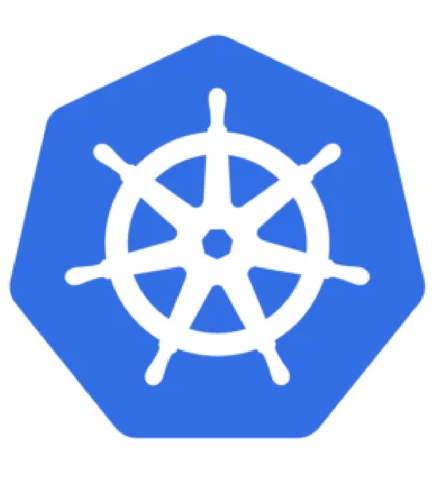
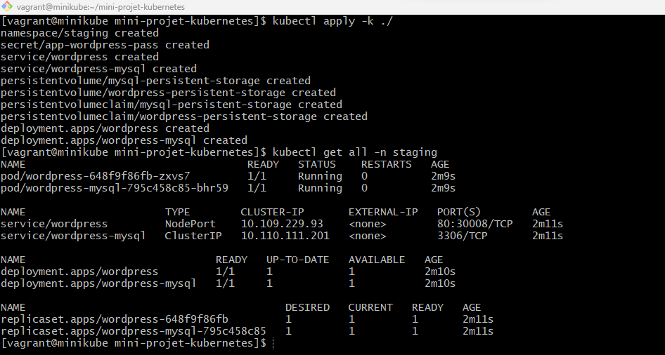
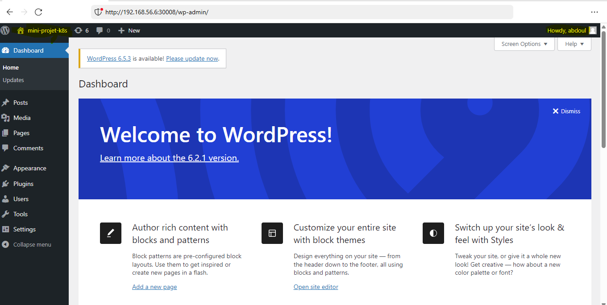

Prénom: Abdoul Gadirou

Nom: DIALLO

Promotion: BootCamp DevOps 17

# Kubernetes Mini-Project

 ### Deploying WordPress and MySQL in K8s




## Objectives

 - Create a **mysql deployment** with a single replica 

 - Create an **IP cluster service** to expose your mysql 
   pods 

 - Create a **wordpress deployment** with a single replica and the right environment variables to connect to the mysql database 
 
 - Create a **nodeport service** to expose the   
   wordpress frontend 

 - Create **PersistentVolumeClaims** and **PersistentVolumes** for the mysql data persistent storage and the wordpress data persistent storage.
 

## Step 1  - Namespace
The resources created will run in the _staging_ namespace.
- app-wordpress-namespace.yml

```
apiVersion: v1
kind: Namespace
metadata:
  name: staging

```
## Step 2  Secret object
For security reasons, the passwords of the wordpress and mysql servers will be saved in a _secret_ type object.
- app-wordpress-secret.yml

```
apiVersion: v1
kind: Secret
metadata:
  name: app-wordpress-pass
  namespace: staging
type: Opaque
data:
  wp_password: d29yZHByZXNz
  mysql_password: bXlzcWw=
  mysql_root_password: bXlzcWxyb290

```


## Step 3: Create PersistentVolumeClaims and PersistentVolumes (mysql)
I used the PV and PVC objects to persist the mysql data with ReadWriteOnce access


- mysqlPV.yml


```
apiVersion: v1
kind: PersistentVolume
metadata:
  name: mysql-persistent-storage
  labels:
    app: wordpress
    tier: mysql
    type: local
  namespace: staging
spec:
  storageClassName: manual
  capacity:
    storage: 2Gi
  accessModes:
    - ReadWriteOnce
  hostPath:
    path: "/data-mysql-pv"

```
  - mysqlPVC.yml

```
apiVersion: v1
kind: PersistentVolumeClaim
metadata:
  name: mysql-persistent-storage
  labels:
    app: wordpress
  namespace: staging
spec:
  storageClassName: manual
  accessModes:
    - ReadWriteOnce
  resources:
    requests:
      storage: 1Gi

```
## Step 4 Mysql Deployment
- service-clusterIP-mysql.yml
  
  To access the mysql resources inside the cluster I created a ClusterIP service.
  This service will be accessible on port 3306.

 ```
 apiVersion: v1
kind: Service
metadata:
  name: wordpress-mysql
  labels:
    app: wordpress
  namespace: staging
spec:
  ports:
    - port: 3306
      targetPort: 3306
      protocol: TCP
  selector:
    app: wordpress
    tier: mysql
  type:  ClusterIP

 ```
- mysql-deployment.yml

  MySQL deployment uses mysql:8.0 image, container mounts PVC volume at _/var/lib/mysql_.
  The MYSQL_ROOT_PASSWORD, MYSQL_PASSWORD environments variables sets the database password from the Secret.

```
---
---
apiVersion: apps/v1
kind: Deployment
metadata:
  name: wordpress-mysql
  labels:
    app: wordpress
  namespace: staging
spec:
  selector:
    matchLabels:
      app: wordpress
      tier: mysql
  strategy:
    type: Recreate
  template:
    metadata:
      labels:
        app: wordpress
        tier: mysql
    spec:
      containers:
      - image: mysql:8.0
        name: mysql
        env:
        - name: MYSQL_ROOT_PASSWORD
          valueFrom:
            secretKeyRef:
              name: app-wordpress-pass
              key: mysql_root_password
        - name: MYSQL_DATABASE
          value: wordpress
        - name: MYSQL_USER
          value: wordpress
        - name: MYSQL_PASSWORD
          valueFrom:
            secretKeyRef:
              name: app-wordpress-pass
              key: mysql_password
        ports:
        - containerPort: 3306
          name: mysql
        volumeMounts:
        - name: mysql-persistent-storage
          mountPath: /var/lib/mysql
      volumes:
      - name: mysql-persistent-storage
        persistentVolumeClaim:
          claimName: mysql-persistent-storage

```


## Step 5 Create PersistentVolumeClaims and PersistentVolumes (wordpress)

As with the wordpress resources, I used the PV and PVC objects to persist the wordpress data with ReadWriteOnce access

- wordpressPV.yml


```
apiVersion: v1
kind: PersistentVolume
metadata:
  name: wordpress-persistent-storage
  labels:
    app: wordpress
    tier: frontend
    type: local
  namespace: staging
spec:
  storageClassName: manual
  capacity:
    storage: 2Gi
  accessModes:
    - ReadWriteOnce
  hostPath:
    path: "/data-wordpress-pv" 
```
 - wordpressPVC.yml

```
apiVersion: v1
kind: PersistentVolumeClaim
metadata:
  name: wordpress-persistent-storage
  labels:
    app: wordpress
  namespace: staging
spec:
  storageClassName: manual
  accessModes:
    - ReadWriteOnce
  resources:
    requests:
      storage: 1Gi

```

## Step 6 Wordpress deployment
 To access wordpress resources outside the cluster, I created a NodePort service. This service will be accessible on port 30008.

  - service-NodePort-wordpress.yml

 ```
 apiVersion: v1
kind: Service
metadata:
  name: wordpress
  labels:
    app: wordpress
  namespace: staging
spec:
  ports:
  - protocol: TCP
    port: 80
    targetPort: 80
    nodePort: 30008
  selector:
    app: wordpress
    tier: frontend
  type: NodePort

 ```

 - wordpress-deployment.yml
 ```
 ---
apiVersion: apps/v1
kind: Deployment
metadata:
  name: wordpress
  labels:
    app: wordpress
  namespace: staging
spec:
  selector:
    matchLabels:
      app: wordpress
      tier: frontend
  strategy:
    type: Recreate
  template:
    metadata:
      labels:
        app: wordpress
        tier: frontend
    spec:
      containers:
      - image: wordpress:6.2.1-apache
        name: wordpress
        env:
        - name: WORDPRESS_DB_HOST
          value: wordpress-mysql
        - name: WORDPRESS_DB_PASSWORD
          valueFrom:
            secretKeyRef:
              name: app-wordpress-pass
              key: wp_password
        - name: WORDPRESS_DB_USER
          value: wordpress
        ports:
        - containerPort: 80
          name: wordpress
        volumeMounts:
        - name: wordpress-persistent-storage
          mountPath: /var/www/html
      volumes:
      - name: wordpress-persistent-storage
        persistentVolumeClaim:
          claimName: wordpress-persistent-storage

 
 ```

## Step 7  use kustomize

 We're going to use kustomize to manage the deployment of our resources
- kustomization.yaml

  ```
  resources:
  - app-wordpress-namespace.yml
  - app-wordpress-secret.yml
  - service-clusterIP-mysql.yml
  - mysqlPV.yml 
  - mysqlPVC.yml 
  - mysql-deployment.yml
  - service-NodePort-wordpress.yml
  - wordpressPV.yml
  - wordpressPVC.yml
  - wordpress-deployment.yml

  ```
  
  